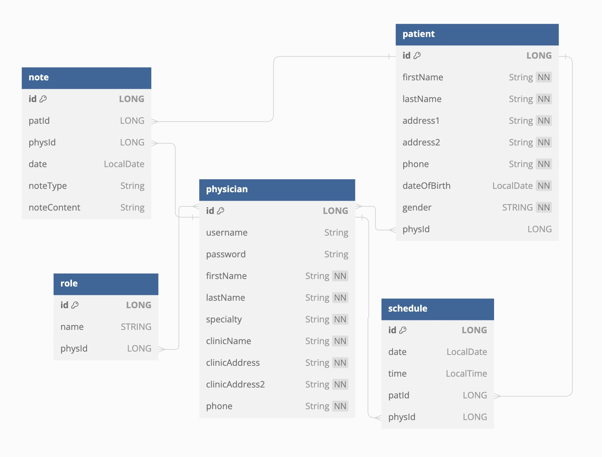

# MedMX: Patient Management System

## Features:
Manages the patient list  
Manages appointments  
Manages notes

## Model Schema:  
  

## Meets the minimal project requirements: 
at least 4 models      
six different view/pages  

## Page Layout:  
### Login Page
### Sign Up Page
### Home page: 
Has navs to Patients page and Schedule page

### Patients list page  
View all my patients  
Add, edit, delete patients  
View patient with specific name  
View patient with specific patient id

### Schedule page  
View/Schedule patient appointment by date  
Access patient from appointment  

### Patient page (individual): 
#### Gen info tab: 
Name, DOB, Address, Phone number

#### Notes tab:  
Access the notes (create, read, edit, delete)

#### Prescription tab: 
Not available  

